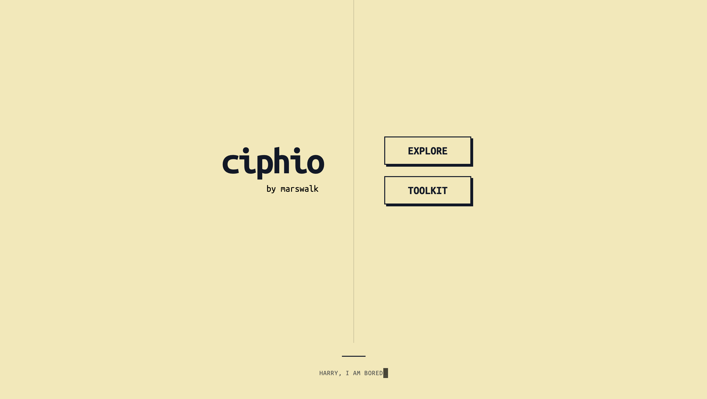
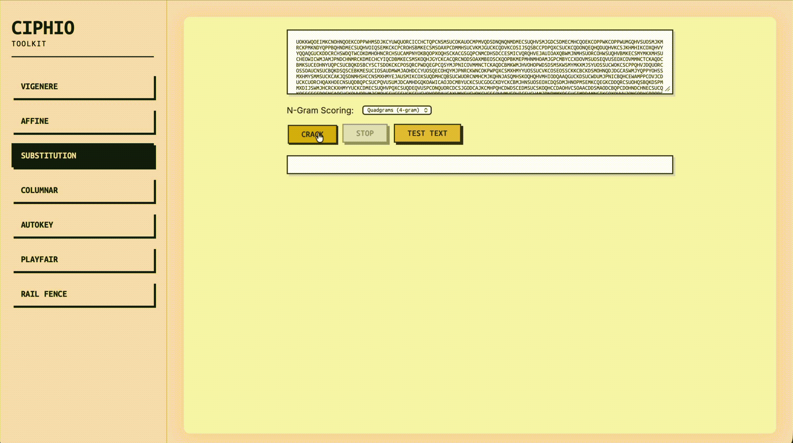
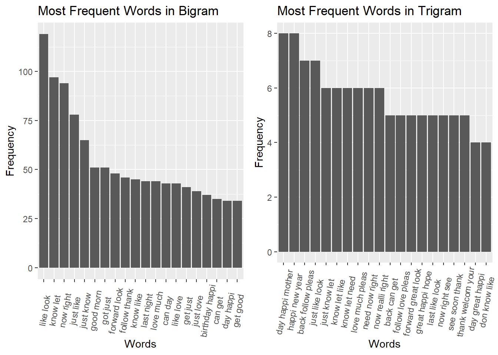
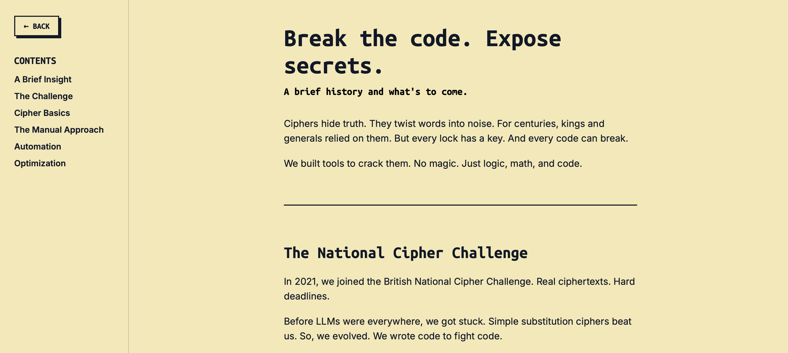

# ciphio:  break the code, secrets expose

Ciphio is a suite of automated decryption tools and an exploration of classic cryptography. It was originally built to compete in the British National Cipher Challenge. Manual decryption was too slow. Brute force was computationally impossible. But visual guidance and patterns was cool. Ciphio is my journey into the classic ciphers and eventually heuristic optimization algorithms and statistical language models. It is an all in one fully automated, and highly customisable solver for 6 common classic ciphers.

## Supported Ciphers

The toolkit includes automated solvers and detection algorithms for:
- Substitution
- Vigenère
- Affine
- Autokey
- Columnar Transposition
- Playfair
- Rail Fence

## How It Works

Ciphio does not rely on brute force. A standard substitution cipher has 26! possible keys. That is roughly 4 × 10²⁶ combinations. Iterating through them would take millions of centuries. 

Instead, Ciphio uses **Text Scoring** and **Heuristic Search**.

### 1. Text Scoring (n-grams)

To evaluate a potential decryption key, the algorithm scores the resulting plaintext against the statistical properties of the English language. 

It calculates log probabilities of *n-grams* (bigrams, trigrams, quadgrams). If a decrypted string contains common quadgrams like "THAT" or "TION", the score increases. If it contains "QXZY", the score decreases. 

*(English letter frequency distribution)*

### 2. Hill Climbing

Finding the highest scoring key is an optimization problem. Ciphio uses **Hill Climbing** to search the key space efficiently.

1. Generate a random key.
2. Decrypt the ciphertext and score the plaintext.
3. Mutate the key (e.g., swap two characters).
4. Decrypt and score again.
5. If the new score is higher, keep the new key.
6. Repeat until the score stops improving.

### 3. Simulated Annealing

Hill climbing is greedy. It often gets stuck in a *local maximum*—a state where any single character swap lowers the score, but the text is still gibberish.

*(The algorithm must escape local maxima to find the global maximum)*

To find the *global maximum* (the true plaintext), Ciphio implements **Simulated Annealing**. 

The algorithm introduces a "temperature" variable. Early in the execution, the temperature is high. The algorithm occasionally accepts a *worse* key. This controlled chaos allows it to jump out of local maxima traps. 

As execution continues, the temperature drops ("cooling"). The algorithm becomes greedier. It eventually settles into the true global maximum, yielding the correct plaintext.

## The Interface, and the new Explore tab

Ciphio wraps these algorithms in a fast, retro-modern interface.  An interactive "Explore" section is currently in the works, which I hope would open this field to more people, of any level in computer science and mathematics, to teach these concepts visually.

## Special Thanks
- Mr. R Dinnage, Whitgift School, for continued support and for leading the training for the Challenge.
- Wei-Shun, for your incredible patience, helpfulness, and teaching me everything I needed here in programming. [@Phoenix465] (https://www.github.com/Phoenix465)
- Sam, for being an excellent teammate during the challenge and pushing me to keep optimising, reading, and learning. [@sambuggburke] (https://www.github.com/sambuggburke)
- Whitgift School, for giving me the once in a lifetime opportunity to present this project in front of alumni in 2023.
